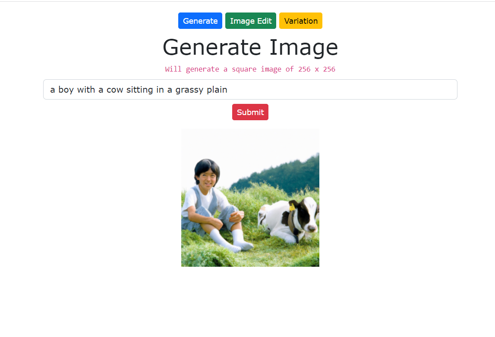
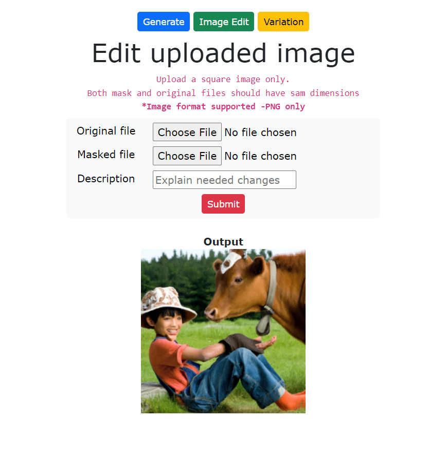
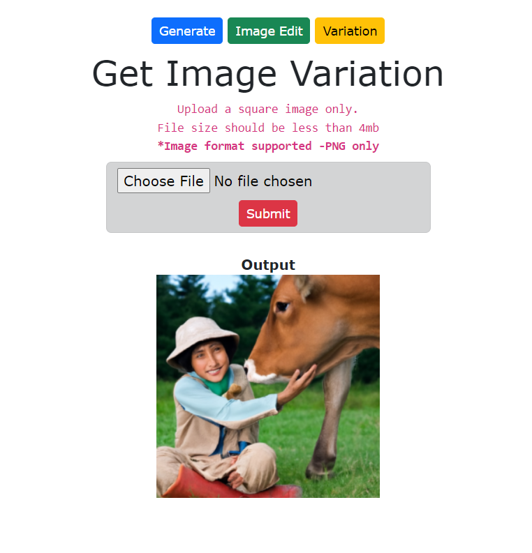

# openai-dalle2-with-nodejs

A Node.js web application which interacts with OpenAI DALL.E model to generate and edit images. Also, generate variations of uploaded images.
You can read more about the tutorial on my blog [openai-dalle-with-nodejs-tutorial](https://techpro.ninja/openai-dalle-with-nodejs-tutorial/)

## Installation & Running

```sh
npm install
```

Running

```sh
node index.js
```

## Screenshots

Few screenshots from this demo application

### Generate image from prompt

.

### Mask an image to edit

.

### Generate image variation

.
